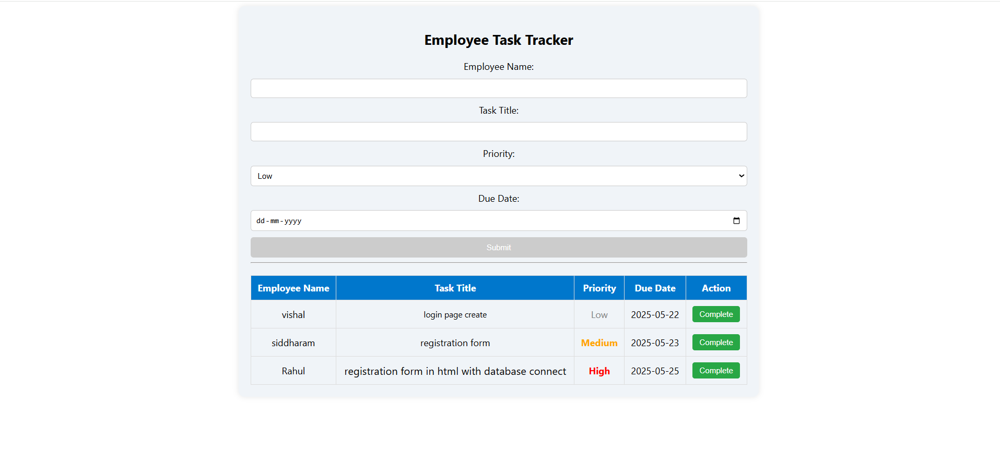

# Employee Task Tracker
This project was generated with [Angular CLI](https://github.com/angular/angular-cli) version 16.2.8.

## 🛠 Features

- Add tasks with:
  - Employee Name
  - Task Title
  - Priority (Low, Medium, High)
  - Due Date
- Display all tasks in a styled table

## 📸 Screenshot



---

## 🛠️ Tech Stack

- Angular
- TypeScript
- HTML & CSS

---

1️⃣ **Clone the Repository**
```bash
git clone https://github.com/vishal-developer1/Employee-Task-Tracker.git
cd employee-task-tracker


